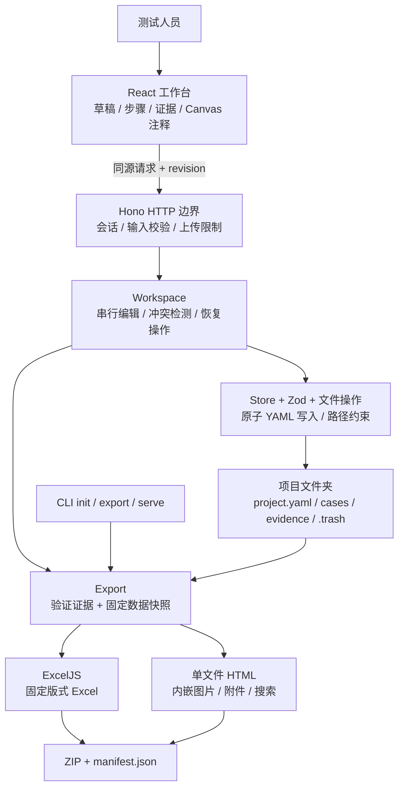

# evikit 0.2：架构与实现说明

2026-09-05。状态：**可运行的本地工作台 alpha**。原有 Phase 0 导出器已经接入真实编辑流程，Phase 1 的用例、步骤、证据录入、截图标注与导出已实现。本文说明当前代码，未实现的内容在末尾单列。

## 1. 我选择的架构

继续采用“项目就是文件夹、证据保留结构、一次记录多种输出”。这几项符合测试交付场景，也能保住已验收的导出版式。主要调整放在编辑后的数据可靠性和可复核性：明确草稿与已保存状态、检测写入冲突、保留原图、可恢复删除、从同一快照导出、完整打包附件。

采用 **Bun + TypeScript + Hono + React/Vite** 的单进程本地应用。一个进程打开一个项目，只监听 `127.0.0.1`。UI、API 与导出共用本地代码；没有数据库、云服务、登录账号、后台同步或 AI 调用。



本文描述浏览器版。独立 Windows 原生版见 [native-windows/ARCHITECTURE.md](../native-windows/ARCHITECTURE.md)。

这是单机编辑工具的分层，不是微服务拆分。以后换 UI 或增加采集入口，入口仍把内容交给相同的四种证据模型；导出器只认识项目数据和证据文件。

## 2. 相比原交接方案的取舍

| 原方案或容易出现的做法               | 0.2 的实现与原因                                                                       |
| ------------------------------------ | -------------------------------------------------------------------------------------- |
| YAML + 证据文件                      | 保留。便于 Git、人工检查、复制交接，不让服务端数据库变成必须恢复的第二份正本。         |
| 四种证据类型 + 八个分类              | 保留。`kind` 决定渲染方式，`category` 说明业务含义；DB 结果仍是表，SQL 放在出典字段。  |
| 在 UI 上直接覆盖 YAML                | 增加文件 revision、单进程锁、写入队列和原子替换，避免旧页面静默覆盖新内容。            |
| 编辑即自动保存                       | 使用明确的草稿和保存。输入中的半成品不会频繁写入文件；证据操作与导出会先保存当前草稿。 |
| 给原截图直接画标记                   | 保留原文件，新增独立 PNG，YAML 保存几何标注。重开编辑仍能读取原图与标注。              |
| 从活跃项目逐段生成 Excel、HTML       | 先校验并复制证据快照，两种输出消费同一份内容。导出期间的 UI 写入在队列中等待。         |
| 只生成 Excel、HTML 与附件目录        | 额外生成 ZIP 和输出文件校验清单；HTML 连附件也内嵌，单独转发不会丢失附件路径。         |
| 删除文件、按当前最大证据 ID 重新编号 | 删除转入恢复记录，证据 ID 的分配上限持久化，旧 ID 不再用于新证据。                     |
| 过早增加数据库、插件、采集执行器、AI | 当前没有引入。先让实际录入→复核→交付成立，后续根据真实项目规模和反馈增加能力。         |

## 3. 模块职责

| 文件或目录                        | 当前责任                                              | 不承担的责任             |
| --------------------------------- | ----------------------------------------------------- | ------------------------ |
| `src/core/types.ts`               | Zod 数据契约；唯一 ID、有效步骤引用、文件名与标注约束 | HTTP、组件状态           |
| `src/core/fs.ts`                  | 路径边界、拒绝内部符号链接、临时文件 + fsync + rename | 业务判定                 |
| `src/core/store.ts`               | YAML 读写、`.yaml/.yml` 兼容、证据文件和编号、SHA-256 | 并发编辑会话             |
| `src/core/detect.ts`、`import.ts` | 输入识别、UTF-8/CSV 规范化、导入上限                  | SQL、HTTP、命令执行      |
| `src/core/verdict.ts`             | 用例判定推导与判定色                                  | 保存或导出流程           |
| `src/core/workspace.ts`           | 编辑命令、revision 检查、串行队列、删除恢复、原图管理 | 浏览器 DOM               |
| `src/server.ts`                   | 本地会话、请求边界、API、上传、预览、静态资源         | 把任意路径暴露为文件服务 |
| `src/export/`                     | 验证快照、Excel、HTML、ZIP、manifest、完整发布        | 修改项目正本             |
| `src/ui/api.ts`                   | 会话交换、JSON/FormData、错误处理                     | 文件系统操作             |
| `src/ui/App.tsx`                  | 当前用例草稿、保存与切换协调、操作状态                | CSV 解析或 Excel 生成    |
| `src/ui/components/`              | 用例表单、步骤表、证据卡片、导入弹窗、标注编辑        | 绕过 Workspace 直接落盘  |
| `src/cli.ts`                      | init / serve / export 生命周期                        | 第二套业务逻辑           |

界面使用原生表单和 `dialog`，图标随构建打包，字体使用系统字体。截图标注编辑器按需加载；JSON/XML/SQL 格式化器也在服务端按需加载。没有为这些功能建立插件框架。

## 4. 数据契约与兼容性

原有 `project.yaml`、`cases/<id>.yaml` 和四种证据保持兼容。`.yml` 文件编辑后仍写回 `.yml`；同名 `.yaml/.yml`、文件名与内容 ID 不一致、重复步骤或无效证据引用都会报错。

新增字段均可省略，旧示例项目无需迁移：

```yaml
id: TC-001
nextEvidenceNumber: 4
# 其余用例字段、steps 保持原格式
evidence:
  - id: E02
    kind: image
    category: 画面
    step: 1
    caption: ログイン画面
    file: E02.annotated-12ab34cd.png
    originalFile: E02.png
    originalSha256: "<原图的 64 位 SHA-256>"
    sha256: "<出图 PNG 的 64 位 SHA-256>"
    capturedAt: "2026-09-05T13:12:34+09:00"
    annotations:
      crop: { x: 100, y: 80, w: 600, h: 400 }
      shapes:
        - { type: rect, x: 150, y: 120, w: 200, h: 60, color: red }
        - { type: number, x: 150, y: 120, n: 1, color: red }
```

此例中的哈希是说明占位符。实际由工具计算。标注和裁剪使用**原图像素坐标**，与屏幕缩放无关；PNG 尺寸必须与裁剪范围一致。颜色固定为红、蓝、黄，支持框、箭头、编号、文字。撤销是编辑器本次操作的历史；“原图に戻す”切换回原图引用。

`file` 是当前导出使用的文件；`originalFile` 只在存在注释版时出现。保存注释时先写新的 PNG，再原子替换 YAML 引用。旧版图片保留，不进行自动垃圾回收。

表格全部以字符串读写。CSV/TSV、BOM、引号内逗号与换行会被规范化为 UTF-8 CSV；不会推断数字、日期或公式。终端表格仅在识别出结构分隔线且列数一致时转换。导入会规范化分隔符和换行，CSV 并不承诺保留原始文本文件的逐字节格式。

采集时间记录本地偏移，不再把 UTC 字符串截短后当成本地时间。未填写的步骤判定按“未実施”处理。旧有自定义判定值与固定导出规则继续由原有判定模块处理。

更严格的校验可能拒绝以前能勉强读取的错误 YAML，这是有意的：损坏引用应在编辑或导出前暴露。当前没有通用 schema 迁移系统；需要不兼容的数据变更时，再引入明确版本和迁移命令。

## 5. 保存、删除与一致性

读取用例返回 `{ data, revision }`，revision 是原始 YAML 字节的 SHA-256。修改请求携带 `If-Match`。缺少 revision 返回 428，过期返回 409，用户草稿留在页面中供核对。UI 不会在冲突时静默重试覆盖。

所有来自本地 API 的修改和导出进入同一个 Workspace 队列。项目启动创建 `.evikit.lock`，另一个 evikit 进程无法再次打开同一项目；进程退出清理锁，明确已失效的 PID 锁可自动清理。

文件写入采用同目录临时文件、`fsync`、`rename`。普通读取能看到完整的旧文件或新文件。它**不是跨多个文件的数据库事务**：异常断电、操作系统行为、外部编辑器并发修改仍有边界。图片先落盘再换引用，失败可能留下无引用文件，但不会覆盖原图。外部编辑 YAML 或 Git 切换分支，建议先关闭 evikit。

删除证据时将元数据放入 `.trash/<uuid>/entry.json`，证据字节继续保留；删除用例时将 YAML 与证据文件夹移入 `.trash`。UI 通知可立即恢复，服务端恢复操作也能在重启后读取该记录。现阶段没有“回收站列表”画面，关闭通知后须通过 API 指定 archive ID 恢复。恢复不会覆盖同 ID 内容；原步骤已删除时，证据恢复到“共通”。

`nextEvidenceNumber` 保证删除后的 E03 不会被新证据重用，避免恢复时串号。case ID 的新建会做大小写冲突检查，并拒绝 Windows 保留名。

## 6. 导出与交付

导出流程：

1. 读取项目和用例，检查各引用文件是否存在，核对已记录的证据哈希。
2. 在第一次异步转换前完成所引用证据的本地快照。
3. 从快照生成 Excel 和 HTML。WebP 仅在快照中转为 PNG，项目正本不变。
4. 复制 Excel 所需附件，生成 `manifest.json`，计算 Excel、HTML、附件各自的 SHA-256。
5. 生成包含上述文件与 manifest 的 ZIP，全部成功后把临时目录发布到最终输出目录。

输出目录带时间与随机后缀。指定的目录已有文件时拒绝覆盖；发生错误会清理本次临时目录。校验清单用于检查文件一致性，**不是数字签名或法律意义的防抵赖证据**。

Excel 保持原有 `サマリ` + 每用例一 sheet、6/36/32/32/8/14 列宽、图片按像素推进行号、合并单元格显式行高、表格值写字符串等既有规则。HTML 支持 ID/件名搜索、NG 过滤、步骤导航、全表与带行号文本。

HTML 的图片和附件均内嵌，不引用 CDN 或旁置文件。Excel 的普通附件使用 `files/<caseId>/...` 相对链接，因此提交 Excel 时应同时提交完整目录或 ZIP。

纳品 ZIP 是交付成果，不是可编辑项目备份；它没有整个 YAML 项目、全部原图或删除历史。编辑交接应复制原项目文件夹。大图片和附件会增加 HTML/ZIP 体积；当前导出在内存中组包，尚未针对数千张图片的项目做压力测试。

## 7. HTTP 接口

全部业务接口需要本地会话。表中所有针对既有项目或用例的修改都需要对应 revision，恢复操作通过 archive ID 及当前内容冲突检查处理。

| 方法与路径                                 | 含义                                          |
| ------------------------------------------ | --------------------------------------------- |
| `POST /api/session`                        | 起动 URL 的连接键交换为 HttpOnly Cookie       |
| `GET /api/project`、`PUT /api/project`     | 项目设置与 revision                           |
| `GET /api/cases`、`POST /api/cases`        | 用例列表、新建                                |
| `GET /api/cases/:id`、`PUT /api/cases/:id` | 用例读取、保存                                |
| `DELETE /api/cases/:id`                    | 用例归档                                      |
| `POST /api/cases/:id/evidence`             | multipart：`metadata` JSON + `file` 或 `text` |
| `PUT /api/cases/:id/evidence/:eid`         | 修改标题、分类、步骤、出典、确认点            |
| `DELETE /api/cases/:id/evidence/:eid`      | 证据归档                                      |
| `PUT /api/cases/:id/evidence/:eid/image`   | multipart：PNG + annotations，或 `reset=true` |
| `GET /api/cases/:id/evidence/:eid/raw`     | 文件，支持 `original=1`、`download=1`         |
| `GET /api/cases/:id/evidence/:eid/preview` | 表格 100 行／文本 200 行预览及总数            |
| `POST /api/restore/:archiveId`             | 恢复用例或证据                                |
| `POST /api/format`                         | 本地 JSON/XML/SQL 格式化，不执行内容          |
| `POST /api/export`                         | 保存状态的项目导出，返回路径与下载 URL        |
| `GET /api/exports/:id/:name`               | 只返回本次服务会话实际生成的成果物            |

只允许本地回环地址、匹配的 Host 和 Origin；拒绝跨站请求，不启用 CORS。连接键在 URL fragment 中，前端交换后移除；Cookie 按启动会话区分，避免同机不同项目串用登录状态。网页不接受任意文件路径，也不把 SQL、日志、HTML 附件作为应用代码执行。

非图片原始文件强制作为附件下载，导出的 HTML 在独立 CSP sandbox 下查看。项目内不允许路径穿越或符号链接。这里防范的是其他网页误访问本地服务和错误文件引用，不承诺抵抗有同等文件系统权限的恶意本机进程。

## 8. 已实现的体验

- 日文工作台：项目设置、用例搜索与 NG 过滤、新建/编辑用例、案例概览。
- 可编辑步骤：添加、删除、上下移动、判定；重排时同步证据的步骤引用。
- 证据：粘贴文本/剪贴板文件、文件选择、拖放、导入预览、自动识别、SQL 出典、确认点与分类。
- 图片标注：框、箭头、编号、文字、三种颜色、裁剪、撤销、保存、恢复原图。
- 结构化表格、带行号日志、关键词高亮、原文件下载；格式化需显式点击，不自动改写内容。
- 明确的未保存提示、离开保护、删除后恢复、导出进度与结果入口。

布局采用浅灰侧栏、白色工作区、绿色主操作与薄边框，优先让测试步骤和证据占据空间。界面设计参考为开发阶段的概念图，不作为运行依赖或仓库交付物。

桌面视觉复核覆盖布局层级、日文字体、绿色/灰色配色、间距、按钮与表单、证据图像比例。实际案例文案和示例原图保持真实样本内容，因此与概念图的虚构画面不同。长操作文本允许换行；截图编辑区同时限制宽高，避免大图遮住工具栏。已在 1505 × 1045 桌面视口和 390 × 844 窄屏视口复核。窄屏上传区改为两列网格，操作按钮独占一行，避免文字被挤成竖排；侧栏关闭时退出可见与可聚焦区域。

## 9. 验证记录与实际边界

本次 `bun run check`：**75 pass / 0 fail，237 个断言**；`tsc --noEmit` 与 Vite 生产构建均通过。覆盖原有导出、识别和存储测试，以及 Workspace/API 的冲突、归档恢复、编码、路径、注释、哈希与组包。

使用项目副本在 Codex 内置浏览器实际执行了：新建 TC-004 → 填写步骤 → 粘贴含 `00012` 的 TSV → 保存 SQL 出典 → 选择 PNG → 画框/箭头/编号 → 新增 NG 步骤与日志 → 重排 → 删除/撤销 → 离开时保存草稿 → 裁剪/撤销/再编辑/文字标注 → 生成成果物。重新打开图像后，标注和裁剪范围仍在。桌面页面正常加载，无空白、框架错误覆盖层或已捕获的应用控制台错误。

这次产物回读确认：

- Excel 包含 `サマリ` + 4 个用例，TC-004 判定 NG，前导零保留。
- 重排后日志证据关联 Step 1，SQL 和图片关联 Step 2。
- 注释图为 551 × 523 PNG，保留 4 个标注和原图文件。
- ZIP 中各输出文件与 manifest 的哈希一致。
- 导出 HTML 的用例搜索与 NG 过滤有实际页面状态验证，工作台 ZIP 下载已收到浏览器下载事件。
- 390 × 844 视口验证了侧栏开合、NG 筛选和用例切换，页面没有整体横向溢出，步骤表在自身区域内横向滚动。
- 同一标签页打开重启后的起动 URL 会重新载入并连接；起动 URL 使用临时 launch 参数避免仅改变 fragment 而保留旧会话。

仍未验证的范围：

- Windows 版 Excel 的实际打印缩放、分页效果、相对附件链接点击，以及 Windows 上运行服务端。
- 手机真机、Safari/Edge/Chrome 的完整操作矩阵。此次响应式验证使用内置浏览器的真实尺寸覆盖；Chrome 工具阻止本地测试页，未以其他协议绕过。
- HTML 内嵌附件的真实下载完成。链接数据、下载文件名与按需生成的本地 Blob 已检查，内置浏览器点击后没有回报下载事件；目标浏览器还需复核。Excel/ZIP 下载路由有 API 测试覆盖。
- 剪贴板图片、文件拖放没有完成独立的浏览器动作验收；文本粘贴、文件选择上传及相同后端导入路径已验收。
- 大项目峰值内存、网络盘、断电恢复、跨机器并发编辑。当前以本机单人项目为设计边界。

## 10. 后续工作顺序

先用真实的小型测试项目验证 Windows/Excel 交付效果，再决定扩展。优先级建议：目标浏览器与 Windows 验收 → 回收站列表和项目体积提示 → 数据规模驱动的预览分页/流式导出 → 有明确样本后再做客户模板。

再测试 Run、脱敏、数据库直连、HTTP/命令执行器、Word/PDF、桌面安装包、插件、外部系统同步和 AI 都没有实现。本版不应宣称已经支持这些能力。
